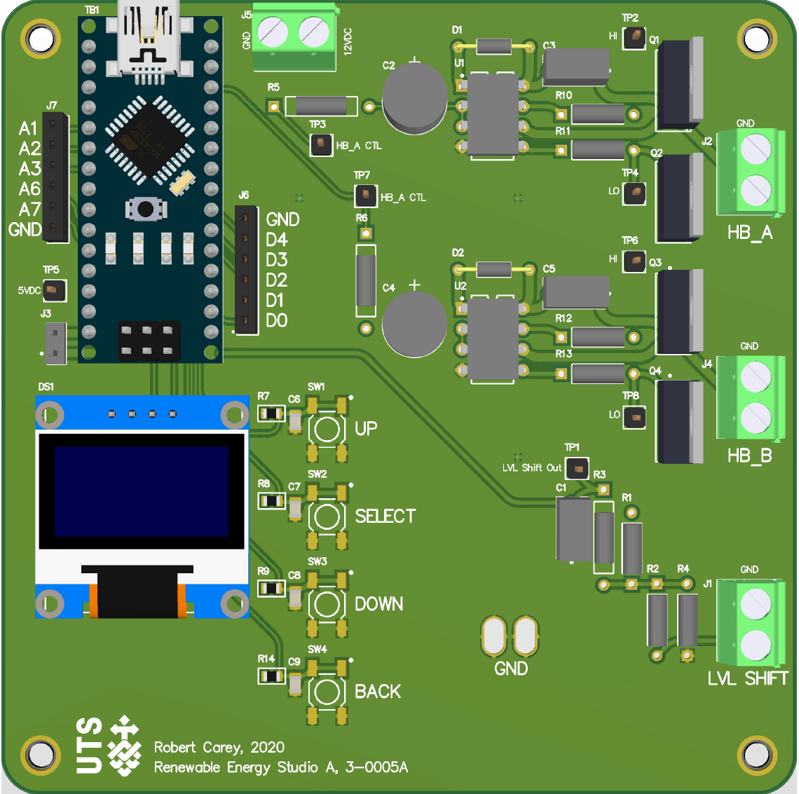

# 2-0004_RES-PCA-Firmware
## Summary
This firmware is designed to run on a arduino nano and drives a DC motor using two IR2103 driver IC's.
It also includes the ability to change parameters using a user interface which consists of 4 buttons and an OLED disply.
## Schematic

## Board

